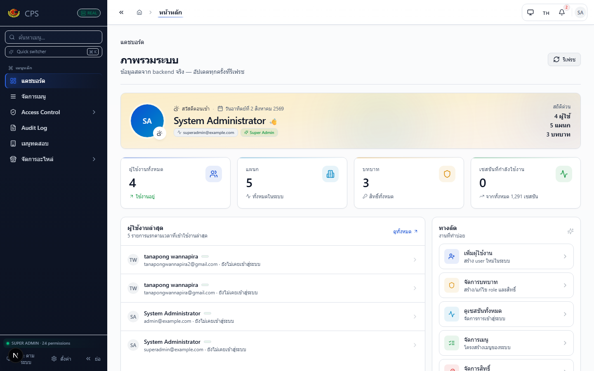
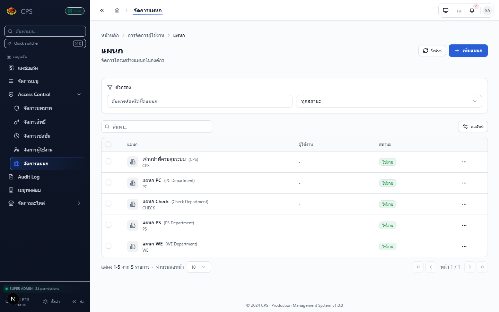
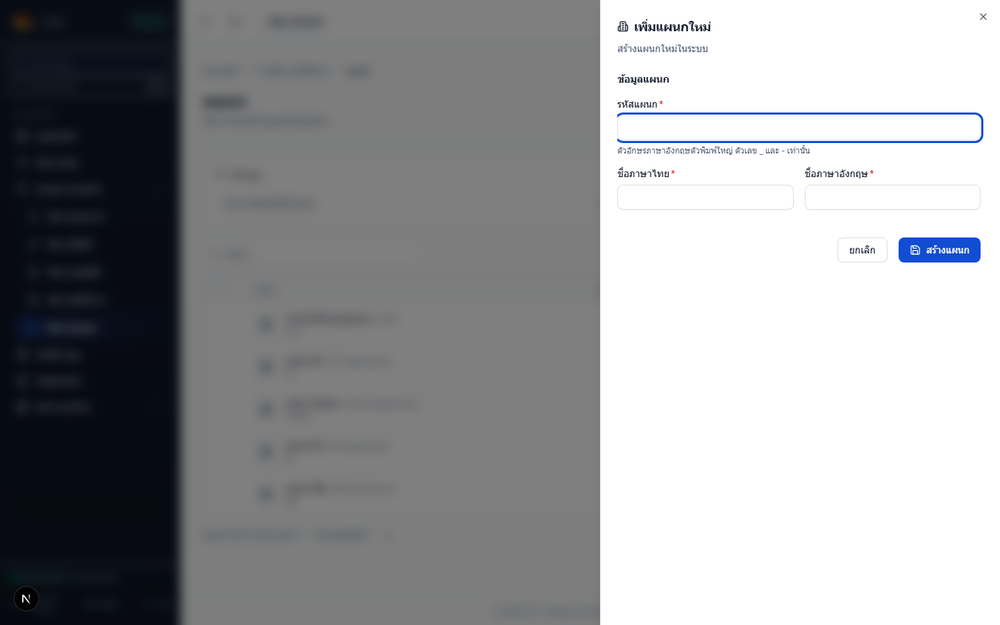
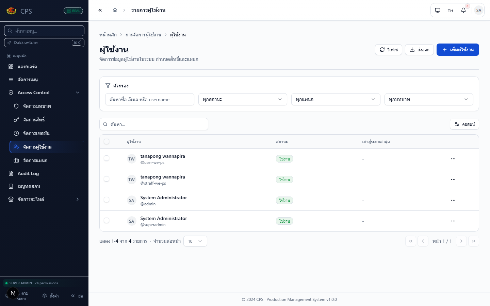
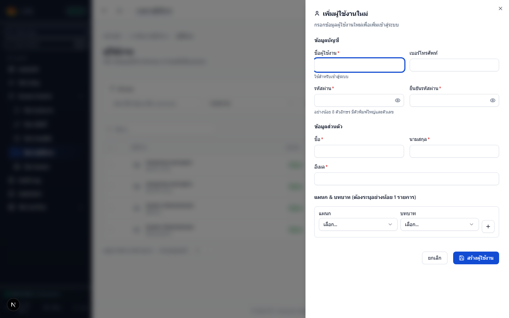
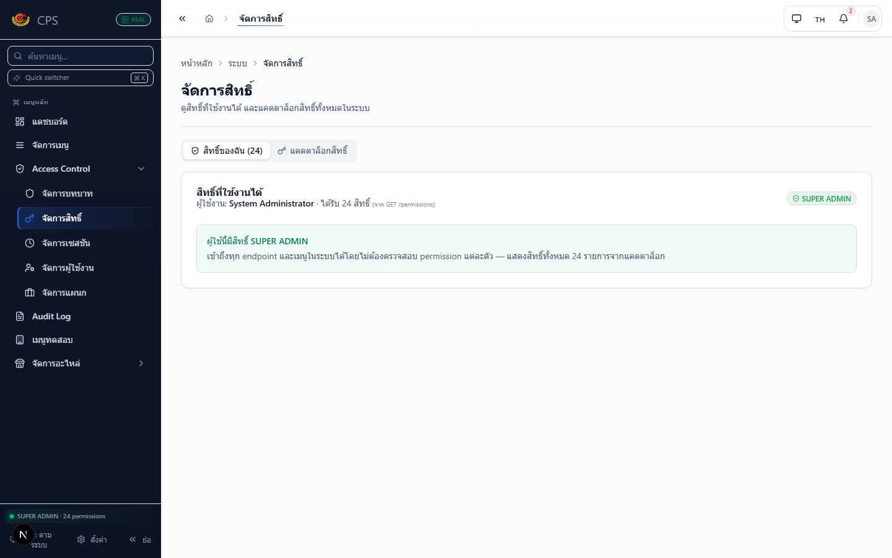
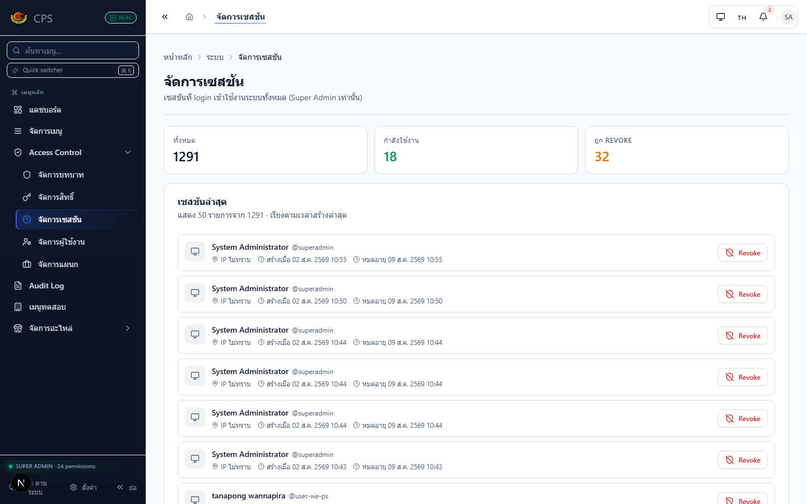

# คู่มือการใช้งานเมนู Access Control (สำหรับผู้ใช้งานทั่วไป)

> คู่มือนี้อธิบายการใช้งานเมนู **Access Control** ตั้งแต่เริ่มต้นจนสร้างผู้ใช้งานใหม่ให้เข้าใช้งานระบบได้
> เขียนด้วยภาษาที่อ่านง่าย หลีกเลี่ยงคำศัพท์ทางเทคนิค
> ทุกชื่อเมนู ปุ่ม และช่องกรอกข้อมูลในคู่มือนี้ ตรงกับหน้าจอระบบจริง

---

## สารบัญ

1. [ภาพรวมเมนู Access Control](#1-ภาพรวมเมนู-access-control)
2. [วิธีเข้าสู่เมนู Access Control](#2-วิธีเข้าสู่เมนู-access-control)
3. [คู่มือเริ่มต้นใช้งาน — ลำดับที่แนะนำ](#3-คู่มือเริ่มต้นใช้งาน--ลำดับที่แนะนำ)
4. [คู่มือกำหนดแผนก](#4-คู่มือกำหนดแผนก)
5. [คู่มือกำหนดบทบาทและสิทธิ์](#5-คู่มือกำหนดบทบาทและสิทธิ์)
6. [คู่มือสร้างผู้ใช้งาน](#6-คู่มือสร้างผู้ใช้งาน)
7. [วิธีเพิ่มผู้ใช้งานเข้าแผนก + เปลี่ยนบทบาท](#7-วิธีเพิ่มผู้ใช้งานเข้าแผนก--เปลี่ยนบทบาท)
8. [วิธีแก้ไขข้อมูลผู้ใช้งาน](#8-วิธีแก้ไขข้อมูลผู้ใช้งาน)
9. [วิธีเปิด/ปิดสถานะผู้ใช้งาน](#9-วิธีเปิดปิดสถานะผู้ใช้งาน)
10. [วิธีเลือกเมนูที่ผู้ใช้งานเข้าถึงได้](#10-วิธีเลือกเมนูที่ผู้ใช้งานเข้าถึงได้)
11. [วิธีดูสิทธิ์ของตัวเอง](#11-วิธีดูสิทธิ์ของตัวเอง)
12. [วิธีจัดการเซสชัน (บังคับออกจากระบบ)](#12-วิธีจัดการเซสชัน-บังคับออกจากระบบ)
13. [ตัวอย่างการตั้งค่าสิทธิ์ตามประเภทผู้ใช้งาน](#13-ตัวอย่างการตั้งค่าสิทธิ์ตามประเภทผู้ใช้งาน)
14. [ตัวอย่างการสร้างผู้ใช้งานตั้งแต่ต้นจนเข้าใช้งานได้](#14-ตัวอย่างการสร้างผู้ใช้งานตั้งแต่ต้นจนเข้าใช้งานได้)
15. [วิธีแก้ไขปัญหาเบื้องต้น](#15-วิธีแก้ไขปัญหาเบื้องต้น)
16. [คำถามที่พบบ่อย](#16-คำถามที่พบบ่อย)
17. [Checklist หลังตั้งค่าเสร็จ](#17-checklist-หลังตั้งค่าเสร็จ)

---

## 1. ภาพรวมเมนู Access Control

**Access Control** คือศูนย์กลางการจัดการ "คน + สิทธิ์ + แผนก" ทั้งหมดในระบบ ใช้สำหรับดูแลว่าใครเข้าถึงอะไรได้บ้าง

เมื่อคลิกเมนู **Access Control** ที่แถบด้านซ้าย จะเห็นเมนูย่อย 5 รายการ ดังนี้

| เมนูย่อย | หน้าที่ |
|---|---|
| **จัดการผู้ใช้งาน** | ดู เพิ่ม แก้ไข ลบ ผู้ใช้งาน รวมถึงเปิด/ปิดการใช้งาน และรีเซ็ตรหัสผ่าน |
| **จัดการแผนก** | สร้างและแก้ไขแผนกต่าง ๆ เช่น แผนก PC, แผนกบัญชี, แผนก IT |
| **จัดการบทบาท** | สร้างกลุ่มสิทธิ์ เช่น "ผู้ดูแลระบบ" "ผู้จัดการ" "เจ้าหน้าที่" แล้วกำหนดสิทธิ์ให้แต่ละกลุ่ม |
| **จัดการสิทธิ์** | ดูสิทธิ์ทั้งหมดที่มีในระบบ (แคตตาล็อกสิทธิ์) และดูว่าตัวเองมีสิทธิ์อะไรบ้าง |
| **จัดการเซสชัน** | ดูรายการผู้ที่กำลังล็อกอินอยู่ และสั่งบังคับออกจากระบบได้ |



> **หมายเหตุ**: หน้า "จัดการแผนก" "จัดการผู้ใช้งาน" "จัดการบทบาท" จะแสดง breadcrumb ว่า **หน้าหลัก > การจัดการผู้ใช้งาน > ...**
> ส่วนหน้า "จัดการสิทธิ์" และ "จัดการเซสชัน" จะแสดง breadcrumb ว่า **หน้าหลัก > ระบบ > ...** (ทั้งที่อยู่ใต้เมนู Access Control เหมือนกัน)

---

## 2. วิธีเข้าสู่เมนู Access Control

**ขั้นตอน**

1. ล็อกอินเข้าระบบด้วยบัญชีผู้ดูแลระบบ (ต้องมีสิทธิ์ `SUPER_ADMIN` หรือ `ROLE_VIEW` ขึ้นไป)
2. มองไปที่ **แถบเมนูด้านซ้าย** จะเห็นเมนูชื่อ **Access Control** (มีไอคอนรูปโล่)
3. **คลิกที่ Access Control** เพื่อขยายเมนูย่อย
4. เลือกเมนูย่อยที่ต้องการ เช่น **จัดการผู้ใช้งาน**

> **ถ้าไม่เห็นเมนู Access Control** แสดงว่าบัญชีของคุณไม่มีสิทธิ์เข้าถึง ต้องติดต่อผู้ดูแลระบบสูงสุด



---

## 3. คู่มือเริ่มต้นใช้งาน — ลำดับที่แนะนำ

สำหรับผู้ดูแลระบบที่เพิ่งเริ่มใช้งาน ควรทำตามลำดับนี้เพื่อให้ทุกอย่างเชื่อมโยงกัน:

```
① สร้างแผนก → ② สร้างบทบาท → ③ กำหนดเมนูและสิทธิ์ → ④ สร้างผู้ใช้งาน
→ ⑤ เลือกแผนก → ⑥ เลือกบทบาท → ⑦ ตรวจสอบสิทธิ์ → ⑧ บันทึก → ⑨ ทดสอบเข้าสู่ระบบ
```

| ลำดับ | งานที่ทำ | ไปที่เมนู | ดูรายละเอียด |
|---|---|---|---|
| ① | สร้างแผนก | Access Control → **จัดการแผนก** | [หัวข้อ 4](#4-คู่มือกำหนดแผนก) |
| ② | สร้างบทบาท | Access Control → **จัดการบทบาท** | [หัวข้อ 5](#5-คู่มือกำหนดบทบาทและสิทธิ์) |
| ③ | กำหนดสิทธิ์ของบทบาท | อยู่ในหน้า **จัดการบทบาท** เลือก "แก้ไข" แล้วติ๊กสิทธิ์ | [หัวข้อ 5.2](#52-กำหนดสิทธิ์ให้บทบาท) |
| ④ | สร้างผู้ใช้งาน | Access Control → **จัดการผู้ใช้งาน** | [หัวข้อ 6](#6-คู่มือสร้างผู้ใช้งาน) |
| ⑤⑥ | เลือกแผนก + บทบาท | อยู่ในหน้าสร้างผู้ใช้งาน (ตอนสร้าง) | [หัวข้อ 6.3](#63-แผนก--บทบาท-ต้องระบุอย่างน้อย-1-รายการ) |
| ⑦ | ตรวจสอบสิทธิ์ก่อนบันทึก | ดูที่หน้า **จัดการสิทธิ์** แท็บ "สิทธิ์ของฉัน" | [หัวข้อ 11](#11-วิธีดูสิทธิ์ของตัวเอง) |
| ⑧ | บันทึก | กดปุ่ม **สร้างผู้ใช้งาน** | — |
| ⑨ | ทดสอบเข้าสู่ระบบ | ล็อกเอาท์ แล้วล็อกอินใหม่ด้วย username ที่เพิ่งสร้าง | — |

---

## 4. คู่มือกำหนดแผนก

### 4.1 สร้างแผนกใหม่

**เมนูที่ต้องเข้า**: Access Control → **จัดการแผนก**

**ปุ่มที่ต้องกด**: **เพิ่มแผนก** (มุมขวาบน)

**ข้อมูลที่ต้องกรอก** (3 ช่อง ทุกช่องจำเป็น):

| ช่อง | ตัวอย่าง | หมายเหตุ |
|---|---|---|
| รหัสแผนก | `PC` | ตัวพิมพ์ใหญ่ ตัวเลข `_` และ `-` เท่านั้น ระบบจะเปลี่ยนเป็นตัวพิมพ์ใหญ่ให้อัตโนมัติ |
| ชื่อภาษาไทย | `แผนก PC` | — |
| ชื่อภาษาอังกฤษ | `PC Department` | — |



**ผลลัพธ์หลังบันทึก**:
- แผนกใหม่ปรากฏในตารางทันที
- ป้ายสถานะเป็น **"ใช้งาน"** (สีเขียว)
- แผนกจะอยู่ที่หน้าแรก ๆ ของรายการ (เรียงตามรหัส)

**ข้อควรระวัง**:
- **รหัสแผนกห้ามซ้ำ** กับที่มีอยู่
- รหัสแผนก **แก้ไขไม่ได้หลังสร้างแล้ว** (ต้องลบแล้วสร้างใหม่ถ้าจะเปลี่ยน)
- ชื่อภาษาไทย และชื่อภาษาอังกฤษ **ต้องกรอกทั้งสองช่อง** (ห้ามว่าง)

**วิธีตรวจสอบว่าสำเร็จ**:
1. กลับมาที่หน้ารายการแผนก
2. แผนกใหม่จะปรากฏในตาราง พร้อมรหัส ชื่อ และป้าย "ใช้งาน"

### 4.2 แก้ไขแผนก

**ปุ่มที่ต้องกด**: ที่แถวของแผนกที่ต้องการ คลิก **⋯** (จุดสามจุด) → **แก้ไข**

**สิ่งที่แก้ไขได้**:
- ชื่อภาษาไทย
- ชื่อภาษาอังกฤษ

**สิ่งที่แก้ไขไม่ได้**:
- รหัสแผนก (ระบบจะแสดงเป็นข้อความ ไม่ใช่ช่องกรอก)

**ปุ่มบันทึก**: **บันทึกการเปลี่ยนแปลง**

### 4.3 ลบแผนก

**ปุ่มที่ต้องกด**: ที่แถวของแผนก → **⋯** → **ลบ** → ยืนยัน

> ⚠️ **คำเตือน**: ถ้ามีผู้ใช้งานสังกัดแผนกนี้ การลบอาจกระทบการเข้าถึงเมนูของผู้ใช้งานเหล่านั้น

---

## 5. คู่มือกำหนดบทบาทและสิทธิ์

### 5.1 สร้างบทบาทใหม่

**เมนูที่ต้องเข้า**: Access Control → **จัดการบทบาท**

**ปุ่มที่ต้องกด**: **เพิ่ม Role** (มุมขวาบน)

**ข้อมูลที่ต้องกรอก** (ส่วน "ข้อมูลทั่วไป"):

| ช่อง | ตัวอย่าง | หมายเหตุ |
|---|---|---|
| รหัส Role | `MANAGER` | A-Z, 0-9, `_` เท่านั้น |
| ชื่อ Role | `ผู้จัดการ` | — |
| คำอธิบาย | (ไม่บังคับ) | เช่น "หัวหน้างาน / ผู้จัดการแผนก" |
| สถานะ | ใช้งาน / ระงับการใช้งาน | ค่าเริ่มต้นคือ "ใช้งาน" |

### 5.2 กำหนดสิทธิ์ให้บทบาท

**เมนูที่ต้องเข้า**: ในหน้า "จัดการบทบาท" กด **⋯** ที่แถว Role → **แก้ไข**

ในฟอร์มแก้ไข จะมีส่วน **"สิทธิ์การใช้งาน"** แสดงรายการเมนูทั้งหมดในระบบ (ดึงจากฐานข้อมูลสิทธิ์) แบ่งเป็นกลุ่มตามเมนู เช่น:

- **ผู้ใช้งาน** (มีสิทธิ์ ดู/สร้าง/แก้ไข/ลบ/ส่งออก)
- **บทบาท** (มีสิทธิ์ ดู/สร้าง/แก้ไข/ลบ)
- **แผนก** (มีสิทธิ์ ดู/สร้าง/แก้ไข/ลบ)
- **เมนู** (มีสิทธิ์ ดู/จัดการ)
- **คำขอ/ตั๋ว** (มีสิทธิ์ ดู/สร้าง/แก้ไข/ลบ/มอบหมาย/ส่งออก)
- ... อื่น ๆ

**ปุ่มที่ใช้ได้**:
- **เลือกทั้งหมด** — ติ๊กทุกสิทธิ์ในทุกกลุ่ม
- **ล้างทั้งหมด** — เอาติ๊กออกทั้งหมด
- **ช่องติ๊กที่หัวกลุ่ม** — ติ๊ก/เอาติ๊กทั้งกลุ่มเมนูนั้น ๆ

**ผลลัพธ์หลังบันทึก**:
- Role นี้จะมีสิทธิ์ตามที่เลือก
- ผู้ใช้งานที่ได้รับ Role นี้จะเข้าถึงเมนูและทำงานตามสิทธิ์ที่กำหนด

**ข้อควรระวัง**:
- **System Role** (เช่น SUPER_ADMIN, ADMIN) จะถูกล็อกไม่ให้แก้ไขสิทธิ์ (เว้นแต่คุณเป็น Super Admin เอง)
- เปลี่ยนสิทธิ์แล้ว **ผู้ใช้งานที่ใช้ Role นี้อยู่จะถูกบังคับให้ล็อกเอาท์** เพื่อรับสิทธิ์ใหม่

### 5.3 ดูรายละเอียด / คัดลอก / ลบ Role

| การทำงาน | ปุ่ม |
|---|---|
| ดูรายละเอียด | ⋯ → **ดูรายละเอียด** |
| แก้ไข | ⋯ → **แก้ไข** |
| คัดลอก | ⋯ → **คัดลอก** (สร้าง Role ใหม่ที่มีชื่อต่อท้าย " (สำเนา)") |
| ลบ | ⋯ → **ลบ** → ยืนยัน |

> ⚠️ การลบ Role จะทำให้ผู้ใช้งานที่มี Role นี้สูญเสียสิทธิ์ทั้งหมด

---

## 6. คู่มือสร้างผู้ใช้งาน

### 6.1 สร้างผู้ใช้งานใหม่

**เมนูที่ต้องเข้า**: Access Control → **จัดการผู้ใช้งาน**

**ปุ่มที่ต้องกด**: **เพิ่มผู้ใช้งาน** (มุมขวาบน)




ฟอร์มแบ่งเป็น 3 ส่วน:

### 6.2 ข้อมูลบัญชี (ส่วนบนสุด)

| ช่อง | ตัวอย่าง | หมายเหตุ |
|---|---|---|
| **ชื่อผู้ใช้งาน** * | `somchai.j` | ใช้สำหรับล็อกอิน · ใช้ได้เฉพาะ a-z, 0-9, `.`, `_`, `-` |
| เบอร์โทรศัพท์ | `0812345678` | ไม่บังคับ · ตัวเลขและขีดกลาง |
| **รหัสผ่าน** * | `Test@1234` | อย่างน้อย 8 ตัว · มีตัวพิมพ์ใหญ่ + ตัวเลข |
| **ยืนยันรหัสผ่าน** * | (พิมพ์เดิมอีกครั้ง) | ต้องตรงกับรหัสผ่าน |

### 6.3 ข้อมูลส่วนตัว (ส่วนกลาง)

| ช่อง | ตัวอย่าง | หมายเหตุ |
|---|---|---|
| **ชื่อ** * | `สมชาย` | — |
| **นามสกุล** * | `ใจดี` | — |
| **อีเมล** * | `somchai@example.com` | ต้องเป็นอีเมลที่ถูกต้อง |

### 6.4 แผนก & บทบาท (ต้องระบุอย่างน้อย 1 รายการ)

| ช่อง | ตัวอย่าง | หมายเหตุ |
|---|---|---|
| **แผนก** * | `แผนก PC` | เลือกจากรายการแผนกที่มีอยู่ |
| **บทบาท** * | `ผู้จัดการ` | เลือกจากรายการบทบาทที่มีอยู่ |
| **+** | (เพิ่มแถว) | กดถ้าผู้ใช้ต้องสังกัดหลายแผนก/หลายบทบาท |

> 💡 **เคล็ดลับ**: ถ้าผู้ใช้งานต้องอยู่หลายแผนก (เช่น เป็นทั้งผู้จัดการแผนก PC และผู้ดูแลแผนก IT) ให้กด **+** เพื่อเพิ่มแถวใหม่

**ปุ่มบันทึก**: **สร้างผู้ใช้งาน** (มุมขวาล่างของฟอร์ม)
**ปุ่มยกเลิก**: **ยกเลิก**

**ผลลัพธ์หลังบันทึก**:
- ผู้ใช้งานใหม่ปรากฏในตารางทันที พร้อมสถานะ **"ใช้งาน"** (สีเขียว)
- ผู้ใช้สามารถล็อกอินด้วย username + password ที่ตั้งไว้ได้ทันที

**ข้อควรระวัง**:
- **ชื่อผู้ใช้งานห้ามซ้ำ**
- **รหัสผ่านต้องมีตัวพิมพ์ใหญ่ + ตัวเลข** (อย่างน้อย 1 ตัว)
- **ต้องมีแผนก + บทบาทอย่างน้อย 1 คู่** ไม่งั้นบันทึกไม่ได้
- ผู้ใช้งานใหม่จะ **ต้องเปลี่ยนรหัสผ่านในการล็อกอินครั้งแรก** (ขึ้นอยู่กับนโยบาย)

**วิธีตรวจสอบว่าสำเร็จ**:
1. กลับมาที่หน้ารายการผู้ใช้งาน
2. ผู้ใช้ใหม่จะปรากฏในตาราง
3. ลองล็อกเอาท์ แล้วล็อกอินใหม่ด้วย username/password ที่ตั้งไว้ เพื่อทดสอบ

---

## 7. วิธีเพิ่มผู้ใช้งานเข้าแผนก + เปลี่ยนบทบาท

**เมนูที่ต้องเข้า**: Access Control → **จัดการผู้ใช้งาน**

**ขั้นตอน**:
1. ที่แถวของผู้ใช้งาน คลิก **⋯** → **แก้ไข**
2. ในฟอร์มแก้ไข คลิกแท็บ **"แผนก & บทบาท"** (อยู่กลาง)
3. เพิ่ม/ลบ/แก้ไขรายการ (แผนก, บทบาท) ได้ตามต้องการ
4. กด **บันทึกการเปลี่ยนแปลง**

> 💡 ที่แท็บ "ข้อมูล" ในหน้าต่างดูรายละเอียด ก็มีแท็บ **"แผนก & บทบาท"** เช่นกัน (แต่ดูอย่างเดียว แก้ไม่ได้)

---

## 8. วิธีแก้ไขข้อมูลผู้ใช้งาน

**ปุ่มที่ต้องกด**: ที่แถวของผู้ใช้งาน → **⋯** → **แก้ไข**

**สิ่งที่แก้ไขได้**:
- ชื่อ, นามสกุล, อีเมล, เบอร์โทรศัพท์
- แผนก & บทบาท (ในแท็บ "แผนก & บทบาท")
- เมนูที่เข้าถึงได้ (ในแท็บ "เมนูที่เข้าถึงได้")

**สิ่งที่แก้ไขไม่ได้**:
- ชื่อผู้ใช้งาน (username) — เปลี่ยนไม่ได้
- รหัสผ่าน — ใช้เมนู "รีเซ็ตรหัสผ่าน" แทน

**ปุ่มบันทึก**: **บันทึกการเปลี่ยนแปลง**

---

## 9. วิธีเปิด/ปิดสถานะผู้ใช้งาน

**ปุ่มที่ต้องกด**: ที่แถวของผู้ใช้งาน → **⋯** → **ระงับการใช้งาน** (หรือ **เปิดใช้งาน** ถ้ากำลังระงับอยู่)

| สถานะปัจจุบัน | ปุ่มที่แสดง | ผลลัพธ์ |
|---|---|---|
| ใช้งาน (สีเขียว) | ระงับการใช้งาน | เปลี่ยนเป็น "ระงับ" (สีเทา) — ผู้ใช้ล็อกอินไม่ได้ |
| ระงับ (สีเทา) | เปิดใช้งาน | เปลี่ยนเป็น "ใช้งาน" (สีเขียว) — ผู้ใช้กลับมาใช้งานได้ |

> **ข้อควรระวัง**: การเปลี่ยนสถานะจะ **มีผลทันที** ถ้าผู้ใช้กำลังล็อกอินอยู่ ระบบจะบังคับออกจากระบบในการร้องขอครั้งถัดไป

---

## 10. วิธีเลือกเมนูที่ผู้ใช้งานเข้าถึงได้

> **หมายเหตุ**: เมนูที่ผู้ใช้งานเห็นในแถบซ้าย **ขึ้นอยู่กับสิทธิ์ของบทบาท** (Role) ที่ผู้ใช้งานได้รับ ไม่ได้เลือกทีละคน
> ถ้าต้องการเปลี่ยนเมนูที่ผู้ใช้งานเห็น ให้ไปแก้ที่ **สิทธิ์ของบทบาท** (ดูหัวข้อ 5.2)

**เมนูที่ต้องเข้า**: Access Control → **จัดการผู้ใช้งาน** → เลือกผู้ใช้งาน → **แก้ไข** → แท็บ **"เมนูที่เข้าถึงได้"**

ในแท็บนี้จะแสดง:
- เมนูทั้งหมดที่ผู้ใช้งานคนนี้เข้าถึงได้ (ดึงจากสิทธิ์ของ Role)

> ⚠️ **ข้อควรระวัง**: หากต้องการเพิ่ม/ลดเมนู ให้แก้ที่ **สิทธิ์ของบทบาท** ไม่ใช่แก้ที่ผู้ใช้งานโดยตรง

---

## 11. วิธีดูสิทธิ์ของตัวเอง

**เมนูที่ต้องเข้า**: Access Control → **จัดการสิทธิ์**



ในหน้านี้มี 2 แท็บ:

### แท็บ "สิทธิ์ของฉัน" (แท็บแรก)

แสดงสิทธิ์ทั้งหมดที่คุณมี พร้อม:
- **ชื่อโมดูล** (เช่น ผู้ใช้งาน, บทบาท, แผนก)
- **รหัสสิทธิ์** (เช่น `USER_READ`)
- **Action** (เช่น สร้าง/อ่าน/แก้ไข/ลบ)

> ถ้าคุณเป็น **SUPER ADMIN** จะเห็นข้อความ "ผู้ใช้นี้มีสิทธิ์ SUPER ADMIN" และมีสิทธิ์ทั้งหมดในระบบ

### แท็บ "แคตตาล็อกสิทธิ์" (แท็บที่สอง — เฉพาะ Super Admin)

แสดงรายการสิทธิ์ทั้งหมดที่มีในระบบ (ดึงจากฐานข้อมูล) ไม่ว่าจะถูกใช้งานหรือไม่

---

## 12. วิธีจัดการเซสชัน (บังคับออกจากระบบ)

**เมนูที่ต้องเข้า**: Access Control → **จัดการเซสชัน**



หน้านี้แสดง 3 ตัวเลขสรุป:
- **ทั้งหมด** — จำนวนเซสชันทั้งหมด
- **กำลังใช้งาน** — จำนวนเซสชันที่ยังไม่ถูกยกเลิก
- **ถูก REVOKE** — จำนวนเซสชันที่ถูกบังคับออกไปแล้ว

**วิธีบังคับผู้ใช้ออกจากระบบ**:
1. ที่แถวของเซสชันที่ต้องการ กดปุ่ม **Revoke**
2. ยืนยันในกล่องโต้ตอบ
3. ผู้ใช้นั้นจะถูกบังคับออกจากระบบทันที และต้องล็อกอินใหม่

> **ใช้เมื่อใด**: เมื่อต้องการยกเลิกการเข้าถึงของผู้ใช้บางคนทันที เช่น พนักงานลาออก หรือพบการเข้าถึงที่น่าสงสัย

---

## 13. ตัวอย่างการตั้งค่าสิทธิ์ตามประเภทผู้ใช้งาน

### 13.1 Super Admin (ผู้ดูแลระบบสูงสุด)

**แผนก**: ไม่จำเป็นต้องระบุแผนก (ใช้ได้กับทุกแผนก)
**บทบาท**: `SUPER_ADMIN`
**สิทธิ์**: ทั้งหมด (ระบบจะให้อัตโนมัติ)

### 13.2 Admin (ผู้ดูแลระบบทั่วไป)

**แผนก**: ระบบ (ไม่ผูกแผนก)
**บทบาท**: `ADMIN`
**สิทธิ์แนะนำ**:
- ผู้ใช้งาน: ดู / สร้าง / แก้ไข / ลบ
- บทบาท: ดู / สร้าง / แก้ไข
- แผนก: ดู / สร้าง / แก้ไข
- เมนู: ดู
- คำขอ/ตั๋ว: ดู / สร้าง / แก้ไข / ลบ / มอบหมาย

### 13.3 Manager (ผู้จัดการแผนก)

**แผนก**: แผนกที่ตนเองรับผิดชอบ เช่น `แผนก PC`
**บทบาท**: `MANAGER`
**สิทธิ์แนะนำ**:
- ผู้ใช้งาน: ดู (เฉพาะในแผนกตนเอง)
- คำขอ/ตั๋ว: ดู / สร้าง / แก้ไข / มอบหมาย
- รายงาน: ดู / ส่งออก

### 13.4 User (เจ้าหน้าที่ทั่วไป)

**แผนก**: แผนกที่ตนสังกัด
**บทบาท**: `USER`
**สิทธิ์แนะนำ**:
- คำขอ/ตั๋ว: ดู / สร้าง (ของตนเอง)
- งาน: ดู (งานที่ได้รับมอบหมาย)
- แดชบอร์ด: ดู

---

## 14. ตัวอย่างการสร้างผู้ใช้งานตั้งแต่ต้นจนเข้าใช้งานได้

สมมติว่าโรงงานต้องการเพิ่ม "หัวหน้าช่าง" เข้าแผนก PC ให้สามารถจัดการคำขอซ่อมได้

### ขั้นตอนที่ 1: ตรวจสอบว่ามีแผนก PC หรือยัง

1. ไปที่ Access Control → **จัดการแผนก**
2. ดูว่ามีแผนก PC หรือไม่
3. ถ้าไม่มี → กด **เพิ่มแผนก** แล้วกรอก:
   - รหัสแผนก: `PC`
   - ชื่อภาษาไทย: `แผนก PC`
   - ชื่อภาษาอังกฤษ: `PC Department`
   - กด **สร้างแผนก**

### ขั้นตอนที่ 2: ตรวจสอบว่ามีบทบาท MANAGER หรือยัง

1. ไปที่ Access Control → **จัดการบทบาท**
2. ดูว่ามีบทบาทที่มีสิทธิ์จัดการคำขอ/ตั๋วหรือไม่
3. ถ้าไม่มี → กด **เพิ่ม Role** แล้วกรอก:
   - รหัส Role: `MANAGER`
   - ชื่อ Role: `หัวหน้าช่าง`
   - คำอธิบาย: `หัวหน้าช่าง / ผู้จัดการแผนก PC`
   - สถานะ: ใช้งาน
4. ในส่วน "สิทธิ์การใช้งาน" → ติ๊กสิทธิ์ที่ต้องการ เช่น:
   - คำขอ/ตั๋ว: ดู / สร้าง / แก้ไข / มอบหมาย
   - งาน: ดู / สร้าง / แก้ไข
   - แดชบอร์ด: ดู
5. กด **สร้าง Role**

### ขั้นตอนที่ 3: สร้างผู้ใช้งาน

1. ไปที่ Access Control → **จัดการผู้ใช้งาน**
2. กด **เพิ่มผู้ใช้งาน**
3. กรอกข้อมูล:
   - **ชื่อผู้ใช้งาน**: `tech.lead`
   - **รหัสผ่าน**: `Tech@2026`
   - **ยืนยันรหัสผ่าน**: `Tech@2026`
   - **ชื่อ**: `สมศักดิ์`
   - **นามสกุล**: `ช่างดี`
   - **อีเมล**: `somsak@company.com`
   - **เบอร์โทรศัพท์**: `0812345678`
4. ในส่วน "แผนก & บทบาท":
   - แผนก: เลือก `แผนก PC`
   - บทบาท: เลือก `หัวหน้าช่าง`
5. กด **สร้างผู้ใช้งาน**

### ขั้นตอนที่ 4: ทดสอบ

1. ล็อกเอาท์จากระบบ (คลิกที่ชื่อตัวเองมุมขวาบน → ออกจากระบบ)
2. ล็อกอินใหม่ด้วย:
   - ชื่อผู้ใช้งาน: `tech.lead`
   - รหัสผ่าน: `Tech@2026`
3. ตรวจสอบว่า:
   - เข้าสู่ระบบได้
   - เห็นเมนู "คำขอ/ตั๋ว" และเมนูอื่น ๆ ตามสิทธิ์
   - ไม่เห็นเมนู "Access Control" (เพราะไม่มีสิทธิ์จัดการ Role)

### ขั้นตอนที่ 5: ตรวจสอบสิทธิ์

1. ในฐานะ Super Admin ไปที่ Access Control → **จัดการสิทธิ์**
2. คลิกแท็บ **"สิทธิ์ของฉัน"** (จะเห็นของ Super Admin — เป็นทั้งหมด)
3. หรือไปที่ **จัดการผู้ใช้งาน** → คลิกที่ `tech.lead` → ดูที่แท็บ **"ข้อมูล"** และ **"แผนก & บทบาท"**

---

## 15. วิธีแก้ไขปัญหาเบื้องต้น

### 15.1 ลืมรหัสผ่านของผู้ใช้

**วิธีแก้**:
1. ไปที่ Access Control → **จัดการผู้ใช้งาน**
2. ที่แถวของผู้ใช้ คลิก **⋯** → **รีเซ็ตรหัสผ่าน**
3. ยืนยัน — ระบบจะส่งรหัสผ่านใหม่ไปยังอีเมลของผู้ใช้

### 15.2 ผู้ใช้ล็อกอินไม่ได้

**ตรวจสอบตามลำดับ**:
1. สถานะผู้ใช้เป็น "ใช้งาน" หรือไม่ (ดูที่คอลัมน์สถานะ)
2. ถ้าเป็น "ระงับ" → เปิดใช้งานก่อน
3. ผู้ใช้พิมพ์รหัสผ่านถูกต้องหรือไม่ (ลองรีเซ็ตรหัสผ่านให้)
4. ตรวจสอบว่าผู้ใช้มีแผนก + บทบาทอย่างน้อย 1 คู่ (เปิดแก้ไขดูที่แท็บ "แผนก & บทบาท")

### 15.3 ผู้ใช้ไม่เห็นเมนูบางเมนู

**ตรวจสอบตามลำดับ**:
1. ผู้ใช้มีบทบาทอะไร → ดูที่หน้าผู้ใช้งาน แท็บ "แผนก & บทบาท"
2. บทบาทนั้นมีสิทธิ์เข้าถึงเมนูนั้นหรือไม่ → ไปที่ "จัดการบทบาท" → แก้ไข → ดูว่ามีติ๊กที่เมนูนั้นหรือไม่
3. ถ้ายังไม่เห็น → อาจเป็นเพราะเมนูนั้นถูก "ซ่อน" (isVisible=false) ในระบบ — ต้องติดต่อทีมพัฒนา

### 15.4 ลบแผนกไม่ได้

**สาเหตุที่เป็นไปได้**:
- มีผู้ใช้งานสังกัดแผนกนี้อยู่
- มีบทบาท (Role) อ้างอิงแผนกนี้

**วิธีแก้**:
1. ย้ายผู้ใช้งานออกจากแผนกนี้ก่อน (เปลี่ยนเป็นแผนกอื่น หรือลบผู้ใช้)
2. ลบแผนก

### 15.5 ลบ Role ไม่ได้

**สาเหตุที่เป็นไปได้**:
- มีผู้ใช้งานใช้ Role นี้อยู่

**วิธีแก้**:
1. เปลี่ยน Role ของผู้ใช้งานทั้งหมดที่ใช้ Role นี้เป็น Role อื่นก่อน
2. ลบ Role

### 15.6 หน้าจอแสดง "โหลดไม่สำเร็จ"

**วิธีแก้**:
1. กดปุ่ม **รีเฟรช** (มุมขวาบนของหน้า)
2. ถ้ายังไม่ได้ → ตรวจสอบการเชื่อมต่ออินเทอร์เน็ต
3. ถ้ายังไม่ได้ → ติดต่อทีมพัฒนา (อาจเป็นปัญหาที่เซิร์ฟเวอร์)

---

## 16. คำถามที่พบบ่อย

### Q1: ทำไมสร้าง Role แล้วไม่เห็นในหน้าสร้างผู้ใช้งาน?

**A**: ลองรีเฟรชหน้า (F5) หรือออกจากหน้าแล้วกลับเข้ามาใหม่ ระบบจะดึงรายการ Role ใหม่

### Q2: เปลี่ยนรหัสผ่านผู้ใช้งานได้ที่ไหน?

**A**: ไปที่จัดการผู้ใช้งาน → ⋯ → **รีเซ็ตรหัสผ่าน** (ระบบจะส่งรหัสใหม่ไปทางอีเมล)

### Q3: ลบผู้ใช้งานแล้ว จะกู้คืนได้ไหม?

**A**: ไม่ได้ — การลบผู้ใช้งานถาวร แนะนำให้ "ระงับการใช้งาน" แทน ถ้าไม่แน่ใจ

### Q4: ผู้ใช้งาน 1 คน อยู่ได้กี่แผนก?

**A**: ได้หลายแผนก (ในหน้าสร้างผู้ใช้งาน เพิ่มแถวด้วยปุ่ม **+** ได้)

### Q5: ผู้ใช้งาน 1 คน มีได้กี่บทบาท?

**A**: มีได้หลายบทบาท แต่ละแผนกสามารถมีบทบาทที่แตกต่างกันได้ (เช่น แผนก PC เป็น Manager, แผนก IT เป็น Admin)

### Q6: ถ้าผู้ใช้ลืมรหัสผ่าน และไม่มีสิทธิ์เข้าถึงอีเมล ทำอย่างไร?

**A**: ต้องติดต่อ Super Admin เพื่อรีเซ็ตรหัสผ่าน แล้วแจ้งรหัสใหม่ด้วยวิธีอื่น (เช่น โทรศัพท์, แชท)

### Q7: รหัส Role / รหัสแผนก เปลี่ยนได้ไหม?

**A**: ไม่ได้ (ทั้งคู่) — เพราะรหัสใช้อ้างอิงในระบบ ถ้าจะเปลี่ยนต้องลบแล้วสร้างใหม่

### Q8: ดู Audit Log (ประวัติการเปลี่ยนแปลง) ได้ที่ไหน?

**A**: เมนู **Audit Log** ที่แถบด้านซ้าย (อยู่นอก Access Control)

### Q9: เซสชันคืออะไร?

**A**: คือการล็อกอิน 1 ครั้ง ผู้ใช้ 1 คนอาจมีหลายเซสชัน (เช่น ล็อกอินจากคอมและมือถือพร้อมกัน)

### Q10: ลบเซสชันแล้ว ผู้ใช้ต้องทำอย่างไร?

**A**: ล็อกอินใหม่ (ระบบจะบังคับให้ล็อกเอาท์ทันที)

---

## 17. Checklist หลังตั้งค่าเสร็จ

หลังจากตั้งค่าผู้ใช้งานใหม่เสร็จแล้ว ตรวจสอบตามรายการนี้:

### ✅ ก่อนสร้างผู้ใช้งาน
- [ ] สร้างแผนกเตรียมพร้อม (ถ้ายังไม่มี)
- [ ] สร้างบทบาทเตรียมพร้อม (ถ้ายังไม่มี)
- [ ] กำหนดสิทธิ์ให้บทบาทเรียบร้อย (ดู → สร้าง → แก้ไข → ลบ ตามที่ต้องการ)

### ✅ ตอนสร้างผู้ใช้งาน
- [ ] กรอก **ชื่อผู้ใช้งาน** (ไม่ซ้ำ, ตัวอักษรภาษาอังกฤษ/ตัวเลข/จุด/ขีด/ขีดล่าง)
- [ ] ตั้ง **รหัสผ่าน** ที่ปลอดภัย (≥ 8 ตัว, มีตัวพิมพ์ใหญ่ + ตัวเลข)
- [ ] กรอก **ชื่อ-นามสกุล** จริง
- [ ] กรอก **อีเมล** ที่ใช้งานได้ (ระบบจะส่งรหัสผ่าน/แจ้งเตือนไปที่นี่)
- [ ] เลือก **แผนก** อย่างน้อย 1 แผนก
- [ ] เลือก **บทบาท** อย่างน้อย 1 บทบาท (ต้องคู่กับแผนก)
- [ ] กด **สร้างผู้ใช้งาน**

### ✅ หลังสร้างเสร็จ
- [ ] ตรวจสอบว่าผู้ใช้ปรากฏในตาราง พร้อมสถานะ "ใช้งาน"
- [ ] ทดสอบล็อกอินด้วย username + password ที่ตั้งไว้
- [ ] ตรวจสอบว่าเมนูที่ผู้ใช้ควรเห็น ตรงตามสิทธิ์ของบทบาท
- [ ] แจ้งรหัสผ่านให้ผู้ใช้ทางช่องทางที่ปลอดภัย (ไม่ส่งทางแชทสาธารณะ)
- [ ] แนะนำให้ผู้ใช้เปลี่ยนรหัสผ่านหลังล็อกอินครั้งแรก

---

## ภาคผนวก: คำศัพท์ที่ควรรู้

| คำ | ความหมาย |
|---|---|
| **ผู้ใช้งาน (User)** | คนที่ล็อกอินเข้าใช้งานระบบ |
| **แผนก (Department)** | หน่วยงาน เช่น ฝ่ายบัญชี, แผนก IT, แผนก PC |
| **บทบาท (Role)** | กลุ่มของสิทธิ์ เช่น "ผู้ดูแลระบบ" "ผู้จัดการ" "เจ้าหน้าที่" |
| **สิทธิ์ (Permission)** | ความสามารถในการทำงาน เช่น "ดูผู้ใช้งาน" "สร้างผู้ใช้งาน" |
| **เมนู (Menu)** | หน้าจอต่าง ๆ ในระบบ เช่น "จัดการผู้ใช้งาน" "จัดการแผนก" |
| **เซสชัน (Session)** | การล็อกอิน 1 ครั้ง |
| **Super Admin** | ผู้ดูแลระบบสูงสุด เข้าถึงได้ทุกเมนู |

---

> 📌 **หมายเหตุ**: คู่มือนี้จัดทำจากหน้าจอระบบจริง (Next.js Admin Template) ตรวจสอบเมื่อวันที่ 1 สิงหาคม 2569
> ถ้าพบว่าข้อมูลในคู่มือไม่ตรงกับหน้าจอ กรุณาแจ้งทีมพัฒนาเพื่ออัพเดท
